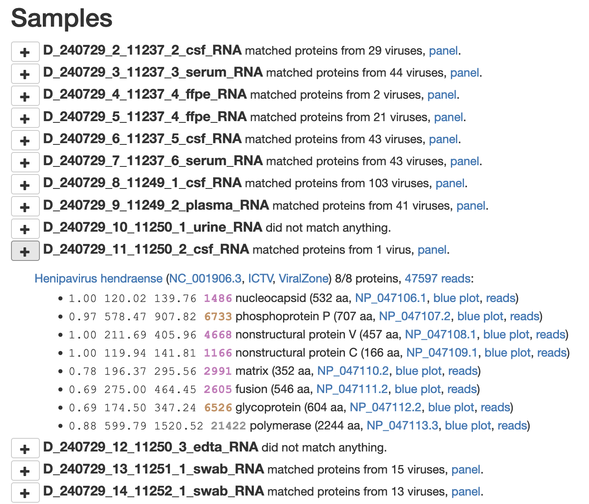

# Jules pipeline hack

## Generate data

```sh
$ make data
```

Calls `make-data.py` to (roughly) do the following:

1. Choose some images.
1. For each image, choose a protein.
1. Convert the image to black and white.
1. Extract the horizontal black lines from the image.
1. Scale the image to be the (aa) length of the protein.
1. Break each horizontal line into some reads.
1. Calculate a bit score for the reads based on how far down we are in the image.
1. Write out fake DIAMOND results for those reads.
1. Write our fake FASTQ files for the reads.

The files to be injected into the pipeline appear in `OUT/json` and
`OUT/fastq`.

## Inject

When the pipeline for the target sample is finished with the
`03-diamond-civ-rna` and `025-dedup` steps:

```sh
$ make add
```

Calls `add-data.py` to:

1. Add the compressed DIAMOND results to the pre-existing `03-diamond-civ-rna` output.
1. Add the compressed FASTQ to the pre-existing `025-dedup` output.

No original data is touched. Only intermediate pipeline outputs are appended
to. The original intermediate files are saved.

## Re-run

```sh
$ make rerun
```

Calls `rerun-pipeline.py` to re-run those two pipeline steps.

## Deployment

The easiest/calmest way to deploy is just to edit the `06-stop/stop.sh`
script for the sample so that it does not remove the `slurm-pipeline.running`
file (or create `slurm-pipeline.done`). Instead you can just make it `touch`
some other file and wait for that file to show up. Then you do the `make add`
and `make rerun`. After that, just `mv slurm-pipeline.running
slurm-pipeline.done` and the sample will be considered done by
`monitor-run.py`.

## Profit

The pipeline results look like this:

<a href="hendra-results.png"></a>

with "blue plots" like this

<a href="Michael-J-Scott-reads.png"></a>
